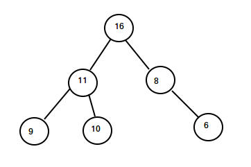

# Heap 

Is a partially ordered dataset, 
where data is stored in a blanced binary tree in which (maxheap) the parent is larger than
its children. However, in most implementation  we do not actually deal with a tree but have 
a more convenient option  where we work with a list and so can directly access 
elements and we do not need to traves linked list. 

### Insert (log(n)):

The most basic ingridient in heap datatype is perhaps adding a new element to an already existing heap. 
When we add an element we are traversing a single branch of the tree, at each step moving 
down the height of the tree, so we can do at most log(n) steps. 

At each step we will do a fixed number of operations (this is a binary tree so each node has at most two children)

How we add an element? We do a kind of bubble sort on a branch. We check if 
our pivot node is larger than its parent, if it is, then we swap them. And the pivot node moves up 
a generation, we continue the comparison with its new parent. If the parent is larger we than stop. 
 
Question: how do we insure the heap is balanced? Since we append the node at the end of the list
it results in a balanced heap where we add a node to the first free location in a layer.     

Question: how one stores the tree? The binary tree is stored as an array where the children of node "i" (numbered 1 to n)  are
"2i" and "2i+1" nodes.   The parent of the current node can be computed by dividing the index of 
the current node by 2.

Code: use a pointer "j" and jump to a parent using numbering left child "2j" 
right child "2j+1" then use recursion on the subtree and a new pivot. 

### Delete root element (log n): 

(There is no delete operation for an intermidiate item)

We delete the root and put the last element in its place. 
Then we proceed to bubble the element down. Similar to insert except we proceed to swap with the node that 
is largest. (How can we insure that we preserve the heap structure? This can destroy the balance?)

### Delete any element in the tree: (log(n))

Replace the deleted element with the furthest right location, 
see  http://www.mathcs.emory.edu/~cheung/Courses/171/Syllabus/9-BinTree/heap-delete.html
and then bubble it up or down as required. 

 if ( replacement node > its parent node )
    bubble the replacement node up the tree
 else
    bubble the replacement node down the tree  
        
          
### Heapify

 - How to convert a list to a heap? Building a heap from an array of n input 
 elements can be done by starting with an empty heap, then successively inserting each element. 
 This approach, called Williams’ method after the inventor of binary heaps, 
 is easily seen to run in O(n log n) time: it performs n insertions at O(log n) cost each.

Start from the leaves and heapify upwards. 
It is based on the observation that the array elements indexed by floor(n/2) + 1, 
floor(n/2) + 2, ..., n are all leaves for the tree (assuming that indices start at 1), 
thus each is a one-element heap. Build-Max-Heap runs Max-Heapify on each of the remaining tree nodes.

So you heapify from the second generation n/2 upwards to newer generations.  

### Others
- Why not binary tree? Balancing a tree might be complicated. 
- Number of nodes at a specific height h (root is the "highest" node): 2^(log(n)-h) ~ n/2^h. 
We have O(h) swaps per node at height h. 
There are n/2^h nodes at a given hight summin sum_{h=0}^{log(n)}  n/2^h O(h) = O(n)
 
### Sorting in place
 Put maximum element at the end of array and du delete operation. 

 
### Ussage

- Priority queue
- Keep the median. 

 
- K largest or K smallest elements in the array 

 